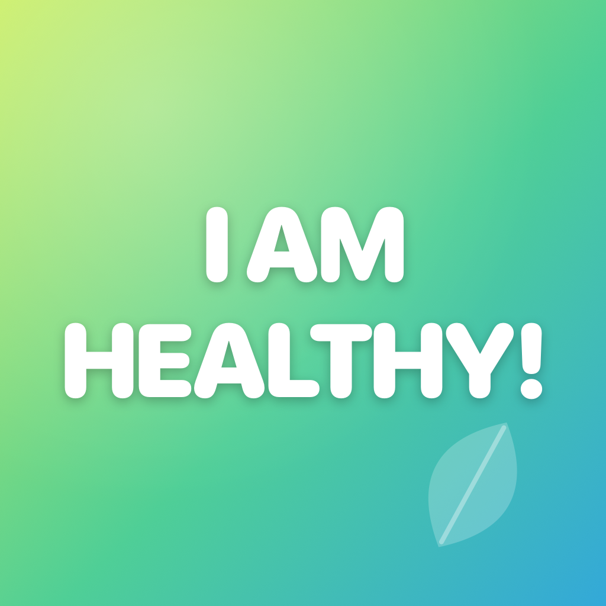

# I Am Healthy!

A simple, lighthearted iPhone weight tracker. Local-first, Apple Health-friendly, multi-person.

🌐 **Website:** [docs/index.html](docs/index.html) (served via GitHub Pages)
🆘 **Support:** [docs/support.html](docs/support.html)
🔒 **Privacy:** [docs/privacy.html](docs/privacy.html)

<p align="center">
  
</p>

## Features

- 📝 Quick weight logging with optional notes
- 📈 Trend chart with 1M / 3M / 1Y / All ranges (Swift Charts)
- 🎯 Per-person goal weight with delta and rough projected ETA
- ❤️ Optional one-way Apple Health sync (write-only Body Mass)
- 👨‍👩‍👧 Multi-person support — separate logs, colors, and goals per profile
- ⚖️ kg or lb display, prompted on first launch
- 🔔 Optional daily local reminder
- 🔒 No accounts, no servers, no analytics — data stays on device

## Requirements

- iOS 17+
- Xcode 15+ (Command Line Tools alone won't build iOS apps)
- [xcodegen](https://github.com/yonaskolb/XcodeGen) for project generation (`brew install xcodegen`)

## Build & run

```bash
cd IAmHealthy
xcodegen generate
open IAmHealthy.xcodeproj
```

In Xcode, pick an iPhone simulator and hit Run. For a real device, set your team in *Signing & Capabilities*.

To regenerate the app icon from source:

```bash
swift scripts/generate-app-icon.swift IAmHealthy/Assets.xcassets/AppIcon.appiconset/AppIcon-1024.png
```

## Project layout

```
IAmHealthy/
├── project.yml                       # xcodegen spec
├── scripts/generate-app-icon.swift   # 1024×1024 icon generator
├── docs/                             # GitHub Pages site
│   ├── index.html
│   ├── support.html
│   ├── privacy.html
│   ├── _shared.css
│   └── icon.png
├── IAmHealthy/
│   ├── IAmHealthyApp.swift
│   ├── Info.plist                    # NSHealthUpdateUsageDescription
│   ├── IAmHealthy.entitlements       # HealthKit
│   ├── Models/{Person,WeightEntry,UserPrefs}.swift
│   ├── Services/{HealthKitService,NotificationService,UnitFormatter}.swift
│   └── Views/
│       ├── RootTabView.swift
│       ├── UnitOnboardingSheet.swift  # first-launch unit prompt
│       ├── PersonSwitcher.swift       # toolbar avatar menu + ActivePersonReader
│       ├── PeopleListView.swift       # add / edit / delete people
│       ├── LogView.swift
│       ├── AddEntrySheet.swift
│       ├── TrendView.swift
│       └── SettingsView.swift
└── IAmHealthyTests/UnitFormatterTests.swift
```

## Design notes

- **kg is canonical.** Weights are always stored in kilograms; the unit toggle only affects display and HealthKit writes use `HKUnit.gramUnit(with: .kilo)`.
- **HealthKit is write-only by design.** The local SwiftData store is the source of truth. Only one person at a time can sync to Health, since Apple Health represents a single device owner.
- **No analytics, ever.** No third-party SDKs, no telemetry.

## GitHub Pages

The `docs/` folder is set up to be served by GitHub Pages directly — no build step.
In your repo settings, under **Pages**, set:

- **Source:** Deploy from a branch
- **Branch:** `main` / `docs`

The site will then be available at `https://<your-user>.github.io/<repo-name>/`.

## License

Add your preferred license here.
